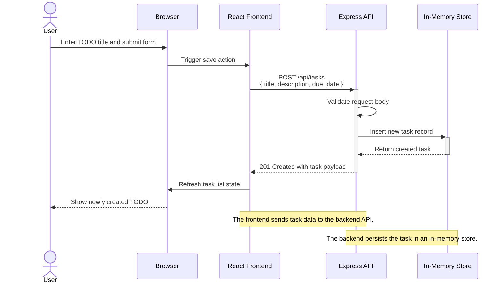

# Cloud Architecture Overview

This document uses a Mermaid sequence diagram to show how a user creates a TODO in the monorepo application.

```mermaid
sequenceDiagram
    actor User
    participant Browser
    participant Frontend as React Frontend
    participant API as Express API
    participant Store as In-Memory Store

    User->>Browser: Enter TODO title and submit form
    Browser->>Frontend: Trigger save action
    Frontend->>+API: POST /api/tasks<br/>{ title, description, due_date }
    API->>API: Validate request body
    API->>+Store: Insert new task record
    Store-->>-API: Return created task
    API-->>-Frontend: 201 Created with task payload
    Frontend->>Browser: Refresh task list state
    Browser-->>User: Show newly created TODO

    Note over Frontend,API: The frontend sends task data to the backend API.
    Note over API,Store: The backend persists the task in an in-memory store.
```